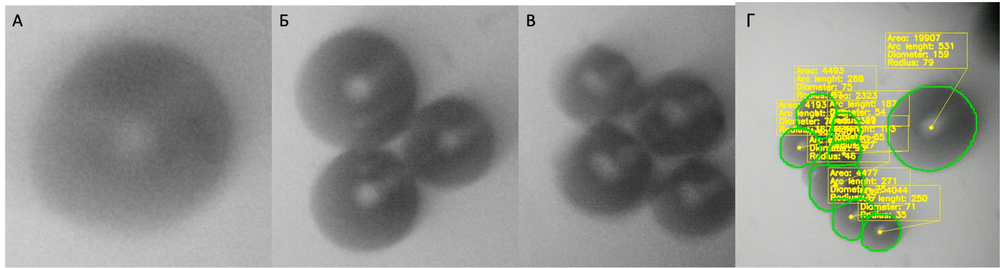
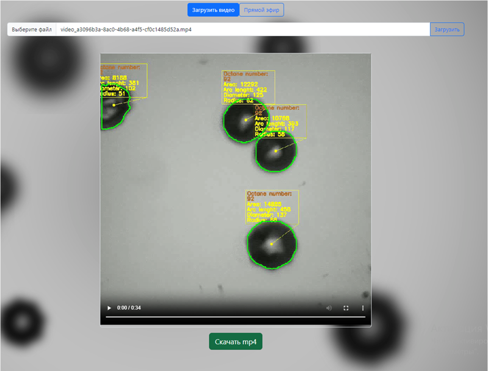

# Octane number analysis with cavitation bubbles and neural networks


 


# Introduction

<p align="center">
    
</p>

This project uses machine learning techniques and the nature of cavitation bubbles to predict the octane number of gasoline.
Cavitation bubbles are formed under the influence of ultrasound, filmed on a high-speed camera. The resulting videos are storyboarded and segmented using a model based on YOLOv8 weights. The area, radius, etc. of each cavitation bubble in the image are obtained from the contours.
Also, a model based on ResNet50 scales is used to classify the octane number in gasoline.

# Data

Data on [raw videos](https://storage.yandexcloud.net/cavitation-bubbles-data/videos.7z), 
individual [frames](https://storage.yandexcloud.net/cavitation-bubbles-data/frames.7z), 
[marked-up frames](https://storage.yandexcloud.net/cavitation-bubbles-data/marked_frames.7z) for segmentation, 
weights of [segmentation](https://storage.yandexcloud.net/itmo-collab-app/weights/segmentation_model.pt) and [classification](https://storage.yandexcloud.net/itmo-collab-app/weights/classification_model.ckpt) models are presented.

# Usage

## API

The server part contains the main computing operations. In particular, neural network models for segmentation and classification are presented here.

### Environment variables

The `api/.env` file is used to override environment variables. Below is a list of environment variables that can be overridden:

- `S3_URL` - optional (yandex cloud by default); S3 URL
- `S3_BUCKET` - optional (`itmo-collab-app` by default); S3 bucket name
- `S3_ACCESS_KEY` - **require**; S3 identification key
- `S3_SECRET_KEY` - **require**; S3 secret key

### Requirements

You can use the pip package manager to install dependencies:
```bash
pip install -r api/requirements.txt
```

You also need to install ffmpeg:

```bash
sudo apt install ffmpeg
```

### Run

To run API use:
```bash
python -m uvicorn api.main:app --host=0.0.0.0 --port=5556
```

### Output example
Segmentation model returns contours of bubble event in difficult frames



## Frontend

To install dependencies for the frontend part, use:

```bash
npm ci
npm run start
```
### Constants
You need to paste domain or ip-address of you API server into frontend constants.

`The URL to backend host is set in src/constants.js.`

### Frontend output example



# Acknowledgment
We thank the [Infochemistry Scientific Center ISC](https://infochemistry.ru) for the provided data and computing power.
This project was carried out with the support of the ITMO.Collab grant 622284 as part of the implementation of the 2030 project.

# License
The code is distributed under the [MIT license](https://opensource.org/license/mit/).
